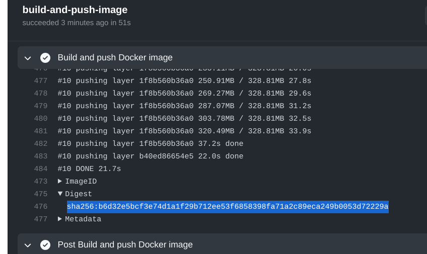

# BUILDING ANDLOGVIEW

## Prerequisites

 * Windows or Linux (macOS would probably work too)
 * OpenJDK 8 or newer (e.g. from [Eclipse Adoptium](https://adoptium.net/)) to run Gradle
 * Internet connection to download dependencies from Maven Central, Gradle Plugin Portal, etc.
 * Git (to check out and commit)

Andlogview is written in Java. It supports JDKs starting from 8 as its runtime environment. However, to make development
easier, the [Jabel](https://github.com/bsideup/jabel) compiler plugin is applied to allow using modern language
constructs from recent Java versions, such as text blocks and `var`.

## Checking out the sources
The repository can be cloned with Git or you can download the latest snapshot in archive from GitHub. The rest of this
chapter assumes that you use Git.

This project uses Unix-style line endings (LF) for all files on all platforms except for Windows Batch (bat/cmd) files
that must use CRLF. I personally prefer to disable line ending translations in Git and configure editors to use
Unix-style line endings. It can be disabled globally, for all Git repos on the machine (beware, it may cause strange
side effects for existing checkouts):
```
git config --global core.autocrlf false
```
It is possible to configure it only for this repository later after checkout.

To get sources run `git clone` with `--recursive` to retrieve submodules:
```
git clone --recursive https://github.com/mlopatkin/andlogview.git
```

If you decided to disable line ending translation only for this repo then run following command inside repo:
```bash
git config core.autocrlf false
# Delete every tracked file in the repo (your uncommited local changes will be lost)
git ls-files -z | xargs -0 rm -f
# Restore tracked files
git checkout -f .
```

Another useful thing is the option to ignore some mechanical commits (reformats) from `git blame`. To do this you need a
recent version of Git and specify file with a list of ignored revisions:
```
git config blame.ignoreRevsFile .git-blame-ignore-revs
```

## Set up hooks

There is a linting pre-commit hook that can be installed for convenience. It checks that files are well-formed before
commit (the same check also runs in pull-requests): proper line endings are used, there are no trailing whitespaces,
each line ends with line ending symbol, there are no tab symbols. To install the hook copy `tools/hooks/pre-commit` to
`.git/hooks/` directory. Make sure that the copy is marked executable.

## Building with Gradle
### Setting up the JDK
Technically, the build uses JDK 17 to compile everything and JDK 8 to run tests. It utilizes Gradle's
[Java Toolchains](https://docs.gradle.org/current/userguide/toolchains.html) to select the proper JDK. You have to
either provide JDKs to Gradle somehow, as described in the docs, or rely on its automated provisioning.

### Useful commands
Run `./gradlew assemble` to build everything. First run takes some time because Gradle binaries and app dependencies
must be downloaded from repositories.

Run `./gradlew check` to run tests.

Run `./gradlew shadowDistZip` to prepare distributive package. The output is placed into `build/distributions`.
You can specify JDK to use with JAVA_HOME environment variable.

## Importing into IDE
#### IDEA
You can use [IDEA Community Edition][idea]. Modern versions work out of the box. Just use
"File > New Project From Existing Sources... > (Select build.gradle in project directory)" or use "Import Existing
Project..." in the startup wizard. The project tries to use the most recent version of Gradle, so it is preferred to
use the latest available IDEA version.

There are project-specific codestyle settings that can be imported. Open "File > Settings > Editor > Code Style". Select
"Project" for "Scheme", then click on Gear icon, select "Import scheme...". Select
`config/idea/idea-codestyle-for-import.xml` in the project directory. Mark "Current scheme" checkbox. The settings will
be imported for this project only. You can also import copyright profiles from `config/idea/copyright` or just copy this
directory into `.idea` (but not when IDEA is running).

### Eclipse
Editing the project in Eclipse IDE is no longer supported. Contributions are welcomed. I had no success in setting up
the project with Eclipse 2022-09.

## Updating the CI build environment

The CI runs Linux build inside the docker container. The container definition lives in
`tools/build-environment/Dockerfile`. To build a new image locally run `docker build tools/build-environment/`. You'll
get an image id, and you can use this ID to start containers. Deploying the new container to the CI is harder and
requires several steps:
1. Submit a PR with the updated Dockerfile
2. Run the ["Build and publish build environment docker image"][docker-workflow] workflow.
3. Grab the digest of the built image from the workflow logs:
   
4. Replace the digest in GitHub workflows in `.github/workflows` with the new digest.
5. Commit changes, update your pull request and merge it as usual
6. ????
7. PROFIT

[idea]: https://www.jetbrains.com/idea/
[docker-workflow]: https://github.com/mlopatkin/andlogview/actions/workflows/publish-docker-environment.yaml
