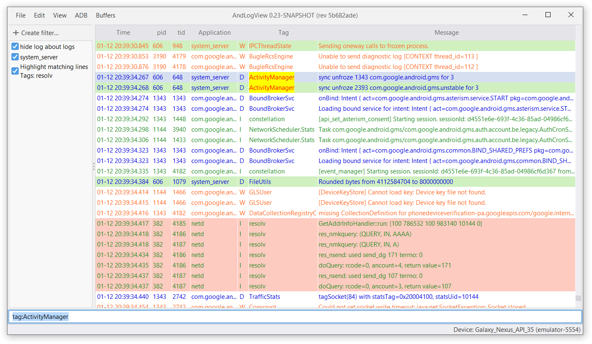

# AndLogView: Log viewer for Android development

https://github.com/mlopatkin/andlogview

Android log viewer is the tool to simplify analysis of the Android logs, both
live from a device or an emulator, or log and dumpstate files.

## Features

* [Display logs from a device or an emulator](/user_manual/adb_mode)
* Display saved logs and dumpstate files
* [Filter log lines by tag, PID, log priority, message content](/user_manual/filters)
  * Filtered lines can be hidden, highlighted or shown in a separate window
* [Search in the logs using regex if needed](/user_manual/search)
* [Bookmarks](/user_manual/other/#bookmarks)
* [Display any avaliable logcat buffers: main, system, events, radio, crash,
  kernel](/user_manual/other/#buffer-types)
* [Save filtered lines](/user_manual/other/#saving-files)
* [Display process list](/user_manual/other/#processes-list)
