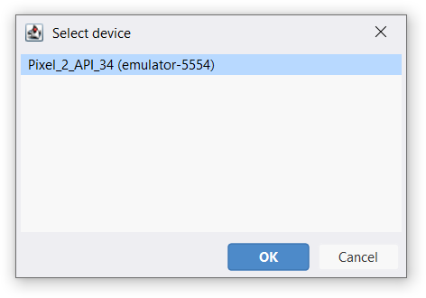

AndLogView can display logs directly from an emulator or a device if you have
the Android SDK installed. Simply run a launching script and the AndLogView
will try to connect to the first available device in the "adb devices" list.
If there is no available devices the tool will be waiting for a device to
connect.

You can use "ADB > Connect to device" in the main menu to select device
to connect to.

"ADB > Reset logs" command clears already retrieved logs, bookmarks
and  processes list.

## ADB Configuration

"ADB > Configuration..." command opens the configuration window. You should
enter the path to the adb executable if it is not on the PATH.

