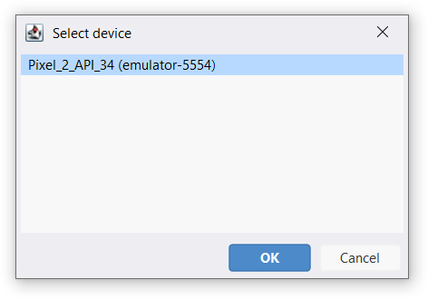
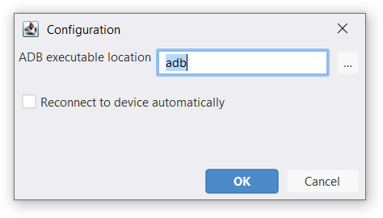

AndLogView can display logs directly from an emulator or a device if you have
the Android SDK installed. Simply run a launching script and the AndLogView
will try to connect to the first available device.
If there is no available devices the tool will be waiting for the device to
connect.

You can use "ADB > Connect to device" in the main menu to select a device
to connect to.

"ADB > Reset logs" command or <kbd><kbd>Ctrl</kbd><kbd>R</kbd></kbd> clears already retrieved logs,
bookmarks and processes list.

## ADB Configuration

"ADB > Configuration..." command opens the configuration window. You should
enter the path to the adb executable if it is not on the PATH.

If the "Reconnect to device automatically" checkbox is set, then AndLogView will
automatically reconnect to the available device if the one currently connected
to disconnects. Use this with caution, because already collected logs are lost
upon reconnecting.

## Installing the Android SDK

You don't need a full Android SDK to capture logs from a device,
just the `adb` from SDK platform-tools and, on Windows, an appropriate device
driver. If you're running an emulator, chances are you already have a full
Android SDK installed.

You can download the plaform tools for your operating system from
[developer.android.com](https://developer.android.com/tools/releases/platform-tools#downloads).

## Connecting to device over USB

You need to [set up the device and your machine](https://developer.android.com/studio/run/device#setting-up)
to be able to connect to the device over USB. Below you can find a quick recap
of necessary steps.



### Installing device drivers on Windows

Device drivers for Google devices (Pixel and Nexus lines) can be downloaded from
the [developer.android.com](https://developer.android.com/studio/run/win-usb).


You don't need to use SDK Manager if you don't have the Android Studio or
the full Android SDK installed, use the
"Download the Google USB Driver ZIP file (ZIP)" link.


Device drivers for devices from other manufacturers are distributed separately.
Some links and the instruction of how to install the driver are also available
on the [developer.android.com](https://developer.android.com/studio/run/oem-usb).



### Configuring permission on Linux
No extra drivers are necessary for Linux, but permissions may need to be
adjusted.

You can follow the instruction on
[developer.android.com](https://developer.android.com/studio/run/device#setting-up)
to do that.



macOS needs no extra configuration.



