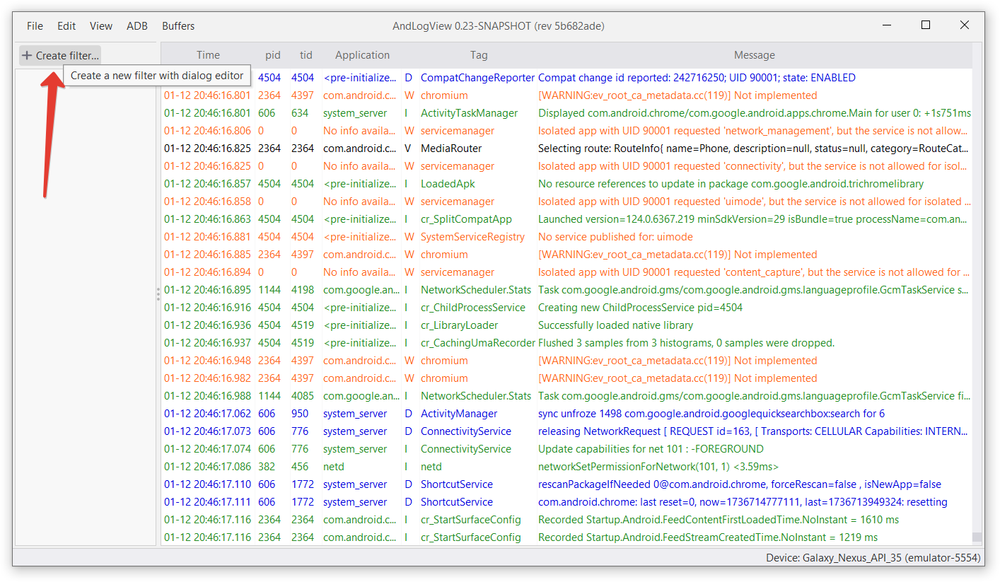
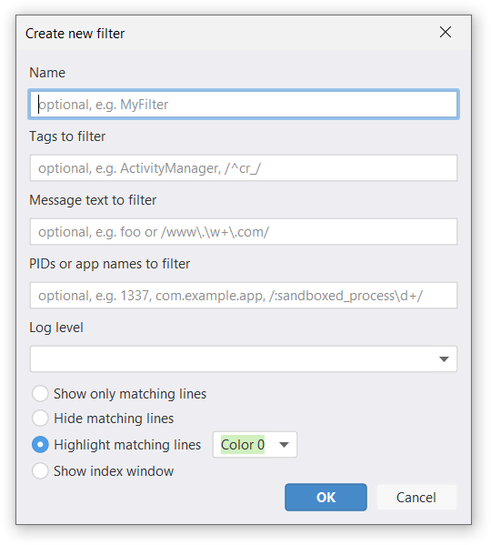
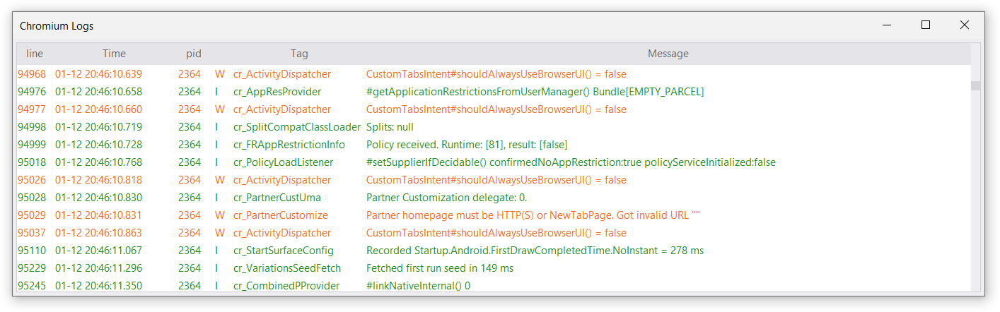
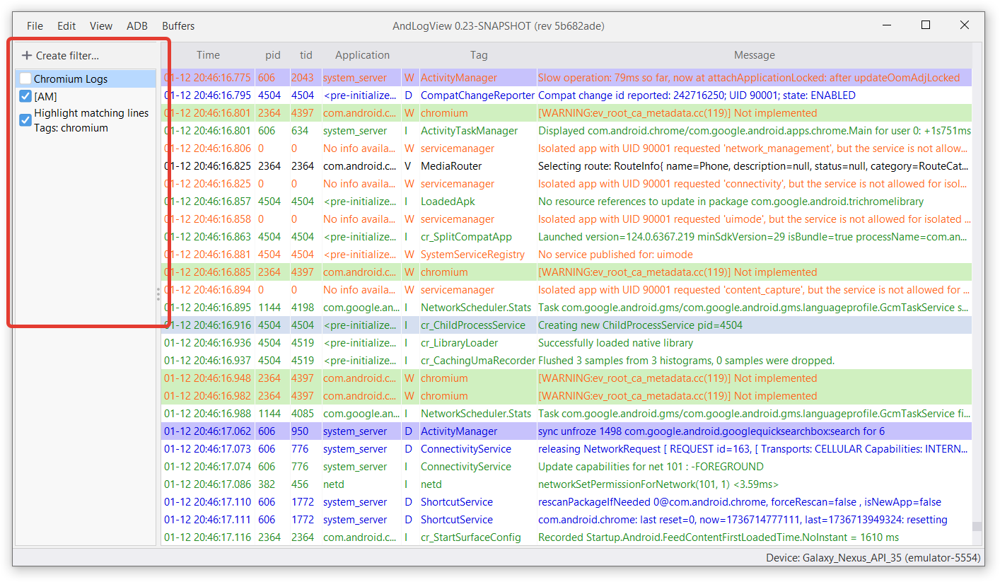
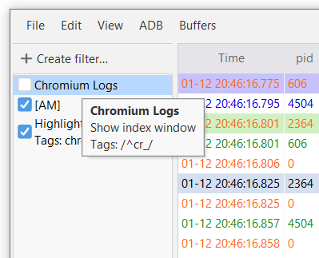
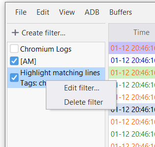
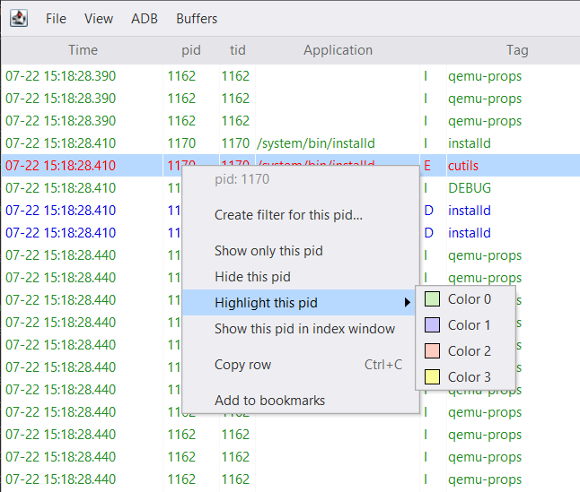

AndLogView provides many ways to highlight interesting log lines and hide
non-interesting. This is achieved with log filtering. Filtered lines can be
highlighted with a background color, hidden, or displayed in a separate window.



## Creating a filter

Use "Create filter…" button to create a new filter:



A filter creation dialog appears:



You can then specify the name of the filter and filtering criteria here:
- "Name" -- the optional display name used, e.g. in the filter list. Without a
   name the visual representation of the filter is derived from the criteria it
   has.
- "Tags to filter" -- the comma-separated list of tags to match
- "Message text to filter" -- the message substring to match
- "<abbr title="Process IDentifier">PIDs</abbr> or app names to filter" --
  the comma-separated list of integer PIDs or app names.
- "Log level" -- the minimal log level to match.

If you specify multiple tags, then a line need to match any of them to match the
filter. The same applies to PIDs and app names.

The filter matches the log line only if all criteria are fulfilled. For
example, if the filter specifies `tag=Foo` and `PID=143, 144` then lines with
the tag `Foo` from PID 441 wouldn't match.

The radio buttons determine the filter's action. The matched lines can be:
- Shown (all other lines will be hidden)
- Hidden
- Highlighted with one of four colors
- Shown in a separate (index) window

## Index window

An index window is a separate window that only shows lines matching the filter.
You can double-click line numbers in the index window to scroll the main
window to them.




The lines visible in the filter are affected by the "show" and "hide" filters,
and the relative order of filters in the list.


## Filter criteria
### Tags
Simple tag filters are case-insensitive and match the whole tag. For example, a
filter `Foo` matches tags `Foo`, `FOO` and `foo`, but not `FooBar`.

You can use [regular expressions](#regexps) to specify tag filters.
Unlike simple patterns, regular expressions match substrings and are
case-sensitive. For example, `/Foo/` matches `Foo` and `FooBar`, but not `foo`.

Multiple tag patterns can be separated with a comma, for example, a filter
`foo, bar` matches both `Foo` and `BAR`. Note that leading and trailing
whitespaces, as well as whitespaces around commas are ignored. The patterns that
contain commas or leading and trailing whitespace can be [escaped](#escape).

You can mix regular expressions and simple patterns.

### Message text
Simple message text filter is case-insensitive and matches a substring of the
log message.

You can use regular expression (regexp) to specify message text filter. The
regexp is case-sensitive.

### PIDs and app names
Integers are always interpreted as PID patterns. Non-integers are interpreted as
app name patterns. Like tags, simple app name patterns are case-insensitive and
match the whole tag. For example, `com.example.app` matches `COM.EXAMPLE.APP`,
but not `com.example.app:boot`.

You can use [regular expressions](#regexps) to specify app name filters.
Unlike simple patterns, regular expressions match substrings and are
case-sensitive. For example, `/com.example.app/` matches `com.example.app`
and `com.example.app:boot`, but not `COM.EXAMPLE.APP`.

Multiple patterns can be separated with a comma, for example, a filter
`com.example.app, system_server` matches both`. Note that leading and trailing
whitespaces, as well as whitespaces around commas are ignored. The patterns that
contain commas or leading and trailing whitespace can be [escaped](#escape).

You can mix regular expressions and simple patterns.

### Regular expressions {#regexps}
Tags, message and app name filters support regular expressions as patterns.
To make pattern a regular expression wrap it in slashes (`/…/`). For example,
`/^[Aa]/` looks up all lines that start with lower or upper `a`.

Standard [Java regular expression syntax][java_pattern] is used.

Regex-based search is case-sensitive, and matches substrings. You can use `^…$`
to match the whole string only.

It is safe to use the slash symbol `/` in the regular expression. However,
commas in tag and app name patterns must be escaped by doubling it. For example,
to use the pattern `/foo, bar/` as a tag pattern you must enter it as
`/foo,, bar/`. Otherwise, it is going to be interpreted as two simple patterns
`/foo` and `bar/`.

[java_pattern]: http://download.oracle.com/javase/8/docs/api/java/util/regex/Pattern.html

## Interaction of multiple filters

If you have created multiple filters the following rules apply:
1. If the log line matches by any of the hiding filters it is hidden
2. If the log line matches by any of the show-only filters it is shown
3. If there is at least one show-only filter and the log line is not affected by
   rules 1 or 2 then it is hidden
4. If there is a highlighting filter and the log line isn't hidden by the rules
   above, it is highlighted with the corresponding color
5. If the line was added to bookmarks and isn't hidden it is highlighted
6. Index window applies all show and hide filters of the main window that
   precede its filter in the filter list.

Only lines in the main window are highlighted. The highlight color is determined
by the last highlighting filter.

## Filter list

The filter list is located on the right side of the main window. Each
filter has a corresponding entry in the filter list. The entry shows either the
name of the filter if it has one, or a summary of the filter's action and
criteria.



The filter can be in two states: enabled (with checkbox checked), when the
filter is active, and disabled (with checkbox unchecked), when the filter is
temporarily skipped. You can toggle between these states by clicking on the
checkbox or by selecting a filter and pressing <kbd><kbd>Space</kbd></kbd>

If the filter's action is "Show in index window", then toggling the filter
toggles visibility of the corresponding index window. Closing the index window
unchecks the checkbox.

A tooltip of the filter item shows a summary of the filter:



## Edit or remove a filter

Use the filter item's context menu to edit or remove the filter.



## Reorder filter

Drag and drop filters to change their order. Highlighting filters and index
window filters are sensitive to the order.

## Quick filters

You can quickly create a filter for PID, app name, tag, priority, or message
text of the line by right-clicking on the corresponding cell in the main window.



"Create filter for this {pid, app, priority, tag, message}…" opens the
pre-filled filter creation dialog. Other actions create the filter immediately.

## Escaping characters in text patterns {#escape}

Slash, comma, and whitespace have special meaning when used in the patterns for
tag, PID, and app name filters. When you need to use these symbols as part of
a pattern, they must be escaped.

* If a simple or regular expression pattern contains a comma, the comma symbol
  must be doubled: `foo, bar` becomes `foo,, bar`.
* If a simple pattern contains a leading or trailing whitespace, the pattern
  must be enclosed in backticks.
  For example, `··foo` must be entered as ``` `··foo` ``` (a space is represented
  as `·` for clarity).
* Backticks can also be used to escape commas in simple patterns. For example,
  `foo, bar` can be entered as ````foo,, bar````.
* Leading and trailing whitespaces are meaningful for regular expression
  patterns. For example `/·foo/` matches `foo` with a leading space (the space
  is represented as `·` for clarity).
* Using backtick symbol in the pattern is safe, unless it is the first symbol or
  the pattern is enclosed in backticks.
* A backtick symbol in the pattern enclosed in backticks must be doubled.
* A pattern that starts with a backtick symbol must be enclosed in backticks.
* A simple pattern may start or end with a slash, but not both. Such pattern is
  always interpreted as a regular expression. You can convert the pattern to a
  regular expression as a workaround.
* A regular expression pattern may contain slash symbols anywhere.

Wrapping regular expression pattern in backticks is not supported and not
needed in general.


Message pattern and search do not support escaping, and do not need it in most
cases.


When opening the filter for editing, you may notice that the way of escaping
changes. The filter editor doesn't preserve the original escapes and attempts
to employ the simplest possible escaping instead.
