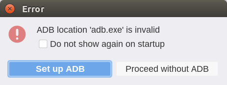

## Requirements
There are several types of installers available:
* Platform-specific installers with bundled Java runtime. These are bigger, but
  you don't need to install Java separately and overall integration with the
  system is better. For now, these installers are only available for the nightly
  builds.

* Platform-agnostic installer is much smaller, but requires installing the
  Java runtime separately.

In general, you need the following:
* A machine with Windows, Linux, or macOS installed. GUI support is mandatory.
* For noJRE distribution only - Java: JRE or JDK 8+ (version 17+ is recommended)
* Android SDK Platform-Tools (optional, to work with a device or an emulator)

## Installing




### Installing Java

If you don't have Java installed, you can download
[Eclipse Temurin JRE](https://adoptium.net/temurin/releases/?version=17&os=any&package=jre)
for your operating system and hardware architecture.

The Java executable (`javaw.exe` on Windows and `java` on Linux/macOS) is
expected to be on `PATH`. Alternatively, the `JAVA_HOME` environment variable
should point to the JRE/JDK.

### Installing AndLogView

Download the [latest release archive][gh_latest_release] from GitHub, and
unpack it into the location of your choice.

To run AndLogView, use the OS-specific script:
* `bin/logview.bat` (Windows)
* `bin/logview` (Linux/MacOS X)

[gh_latest_release]: https://github.com/mlopatkin/andlogview/releases/latest
[temurin_download]: https://adoptium.net/temurin/releases/?version=17




A x64 Linux machine capable of installing DEB packages (like Debian, Ubuntu,
Mint) is required.

1. Download the appropriate `deb` installer from [nightly builds on GitHub][gh_nightly_release].
2. Run `sudo dpkg -i <path-to-downloaded-installer>.deb`

AndLogView should be available in the application list of your Desktop
Environment (Start Menu) and as `andlogview` in the terminal.

[gh_nightly_release]: https://github.com/mlopatkin/andlogview/releases/tag/latest-snapshot




1. Download the appropriate `exe` installer from [nightly builds on GitHub][gh_nightly_release].
2. Run it. You don't need admin privileges to install.
3. The installer isn't signed (yet), so you may need to bypass the antivirus
   software warning.
4. Configure the installation parameters as you'd like.

AndLogView should be available in the Start Menu or on Desktop, depending
on your choices during installation.

[gh_nightly_release]: https://github.com/mlopatkin/andlogview/releases/tag/latest-snapshot



<!--
TODO(mlopatkin): https://github.com/mlopatkin/andlogview/issues/339
If adb.exe/adb aren't on the `PATH` you should manually set its location at the
first launch. You will be prompted about it:

Click "Yes" to open [[AdbMode | ADB setup dialog]]. However it is necessary
for working with device/emulator only.
-->
