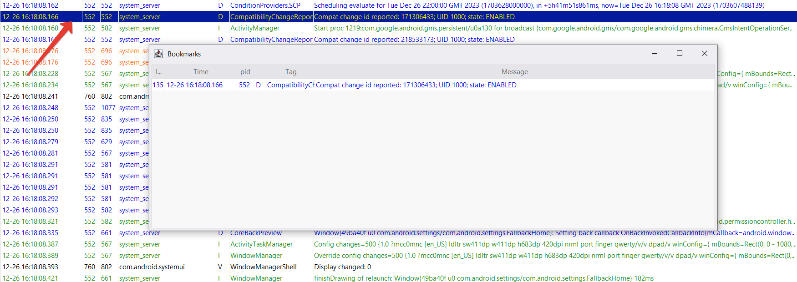
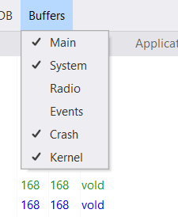
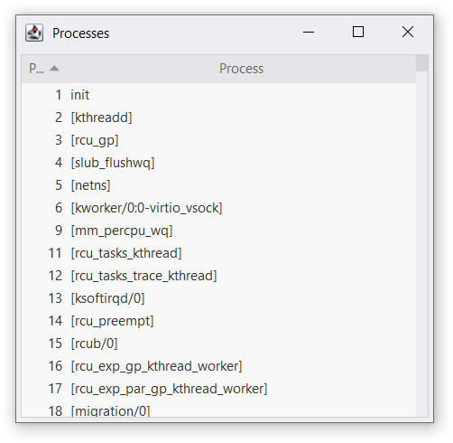



## Bookmarks

The bookmarks windows can be used for quick jumping between marked lines.

Right-click on the line and select "Add to bookmarks" to add the line to
bookmarks. Bookmarked lines are highlighted with dark blue background:

Double-click on the line in the bookmark window to scroll the main window to it.

To remove one or several lines from bookmarks select them and press
<kbd><kbd>Del</kbd></kbd> or use "Remove from bookmarks" command of the context
menu.

The bookmark windows opens when a line is added to bookmarks or with a
"View > Show bookmarks" command in the main menu.

## Buffer types

The Android logging system contains several logging buffers:
`main`, `radio`, `events`, `system`, `crash`, `kernel`, and `security`. Not all
buffers are available on all Android versions.

If the information about source buffer of the line is available you can use
filtering by buffer type: check interesting buffers in the "Buffers" menu.


Security buffer is not yet supported by AndLogView.


## Saving files

All lines that passes filters will be saved when you select "File > Save".
Actual format of the resulting file depends of the log verbosity:
* brief, if only pid, priority, tag and message are known
* time, if the time is known too
* threadtime, if the tid is known too

## Processes list

If an information about the running processes is available (you're viewing
logs from a device, emulator, or a dumpstate file) then you can see it in the
"Processes" window. Use "View > Show processes" command in the main menu to
open the window.

This window displays all processes that are known to the tool including already
terminated ones. You can clear the list from terminated processes with
"ADB > Reset logs" (this will clear the logs too).

## Clipboard

Your can copy selected log lines using "Copy row" from the context menu or
<kbd><kbd>Ctrl</kbd><kbd>C</kbd></kbd> or
<kbd><kbd>Ctrl</kbd><kbd>Ins</kbd></kbd>.

Double-clicking on PID, TID, tag or message fields enables edit mode and you can
select some text in the field and copy it to the cliboard with
<kbd><kbd>Ctrl</kbd><kbd>C</kbd></kbd> or
<kbd><kbd>Ctrl</kbd><kbd>Ins</kbd></kbd>

This works in all log windows and in the process list.
