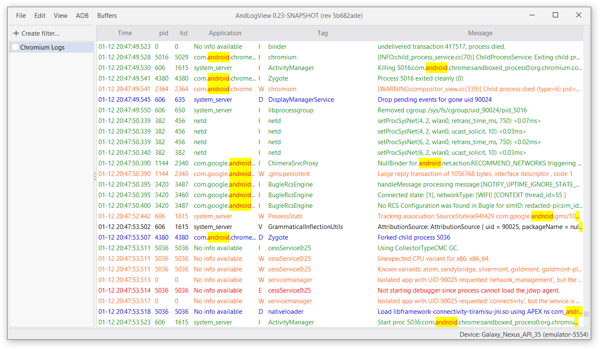

You can search for the pattern occurences in tag, application name, and message
fields.
Press <kbd><kbd>Ctrl</kbd><kbd>F</kbd></kbd>, enter the pattern in the appeared
text field and press <kbd><kbd>Enter</kbd></kbd> to start searching.

Search starts from the current selected log line of from the beginning if no line is selected.

All occurences of the pattern are highlighted (and in the tooltip too)

Use <kbd><kbd>F3</kbd></kbd> and <kbd><kbd>Shift</kbd><kbd>F3</kbd></kbd> to navigate between search result forward and backward.

If there is no more occurrences of the pattern in the given direction from the
selected line then the message appears in the status bar.

Use <kbd><kbd>Esc</kbd></kbd> to stop search and clear highlighting.

Simple text search is case-insesitive.

## Regular expressions

You can search using regular expressions. To do that wrap your pattern in
slashes (`/.../`). For example, `/^[Aa]/` looks up all lines that start with
lower or upper 'a'.

Regex-based search is case-sensitive.

Standard [Java regular expression syntax][java_pattern] is used.

<!-- TODO(mlopatkin) link to filtering page when it is ready -->
You can use regular expressions in tag, application name, and message filters
too.

## Limiting search scope

By default, all available searchable fields (tag, application name, and message)
are looked for matches. You can limit the scope with a prefix:

- `tag:` to only look in tags
- `app:` to only look in application names
- `msg:` to only look in messages

For example, when searching for `app:android`, messages that contain `android`
aren't highlighted:

Only a single prefix is supported, so you cannot specify, for example,
`app:tag:foo` to look in both app names and tags. In fact, `tag:` would be
treated as part of the search pattern.

Regular expression can also be prefixed, like `tag:/(Foo|Bar)/`.

## Limitations

It is not possible to use simple search to search for spaces, tabs or other
blank characters. Should you need this, you can use regular expression search as
a workaround: `/[ ]/`. Note that using just space inside slashes, like `/ /`
doesn't work too, as blank regular expressions are not supported.

[java_pattern]: http://download.oracle.com/javase/8/docs/api/java/util/regex/Pattern.html
